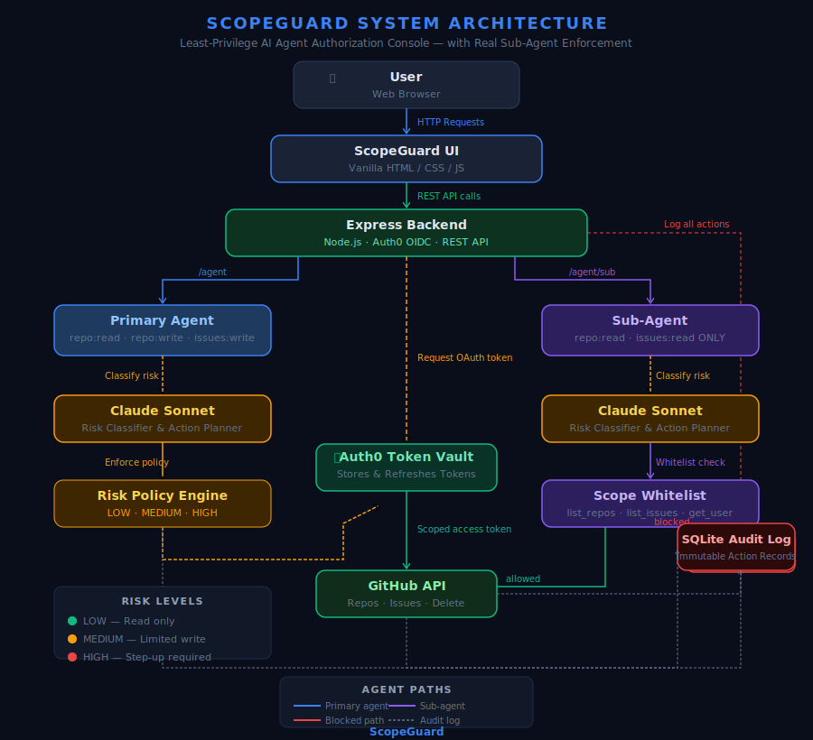

# ScopeGuard — Least Privilege Agent Authorization Console

Built for the Auth0 "Authorized to Act" Hackathon 2026.

**Live Demo:** https://scopeguard-auth0.onrender.com

---

## Problem

AI agents today run with god-mode API keys. No scoping, no audit trail, no user consent. A single compromised agent can read private repos, create issues, or delete repositories with no restriction. ScopeGuard fixes that.

---

## Solution

ScopeGuard is a least-privilege agent authorization console built on Auth0 Token Vault. It enforces the principle that just because an agent HAS a token doesn't mean it's authorized to do everything with it. Authorization is contextual — based on what each agent is delegated to do.

---

## Architecture



---

## Features

### Permission Dashboard
- GitHub OAuth connected via Auth0 Token Vault — tokens never touch agent code
- Live scope badges showing active permissions
- Revoke Access — instantly cuts agent access, logged to audit trail
- Reconnect GitHub — forces fresh OAuth token with `public_repo` scope only (least-privilege enforcement)

### Agent Console — Side-by-Side Comparison
- **Primary Agent** (`/agent`) — Claude Sonnet with `repo:read`, `repo:write`, `issues:write`
- **Sub-Agent** (`/agent/sub`) — Claude Sonnet with `repo:read`, `issues:read` ONLY
- Same command, two buttons, two different outcomes — demonstrates downward scope delegation live
- Write operations (create issue) succeed on Primary Agent, get **Scope Escalation Blocked** on Sub-Agent
- HIGH risk actions (delete repo) trigger Step-Up Authorization modal before execution

### Agent Delegation Hierarchy
- Visual hierarchy showing Primary Agent → Sub-Agent with GRANTED / INHERITED / BLOCKED scope labels
- Sub-agent enforced via server-side whitelist — `list_repos`, `list_issues`, `get_user` only
- All blocked attempts logged to audit trail with `scope escalation` status

### Risk Classification
- Claude Sonnet classifies every request: LOW / MEDIUM / HIGH
- LOW — read-only, executes immediately
- MEDIUM — limited write, executes with audit log
- HIGH — step-up authorization modal required before execution, blocked in demo mode for safety

### Audit Log
- Every action logged with timestamp, API, scope used, risk level, status
- Covers: login, GitHub connect, token exchange, agent actions, blocked attempts

---

## Tech Stack

| Component | Technology |
|---|---|
| Backend | Node.js / Express |
| Auth | Auth0 OpenID Connect |
| Token Management | Auth0 Token Vault |
| AI Agent | Claude Sonnet (`claude-sonnet-4-20250514`) |
| GitHub Integration | GitHub OAuth via Auth0 social connection |
| Audit Log | sql.js (SQLite in-memory) |
| Frontend | Vanilla HTML / CSS / JS |
| Deployment | Render (free tier) |

---

## Key Technical Decisions

**Why two agents instead of one?**
The sub-agent demonstrates that least-privilege enforcement happens at the action whitelist level, not just the token level. Both agents use the same Auth0 Token Vault token — the restriction is architectural.

**Why `public_repo` scope only?**
The GitHub connection is configured with `public_repo` instead of `repo` (full access). The `/disconnect-github` route unlinks and relinks the GitHub identity via Auth0 Management API, forcing a fresh OAuth token with only public repo access. The GitHub API call also uses `?visibility=public&affiliation=owner` as a second enforcement layer.

**Why server-side whitelist for sub-agent?**
Client-side restrictions can be bypassed. The whitelist lives in `routes/agent.js` on the server — the sub-agent endpoint physically cannot execute write operations regardless of what the user requests.

---

## Setup

```bash
npm install
npm start
```

### Environment Variables

```
AUTH0_DOMAIN=
AUTH0_CLIENT_ID=
AUTH0_CLIENT_SECRET=
AUTH0_SECRET=
AUTH0_MANAGEMENT_CLIENT_ID=
AUTH0_MANAGEMENT_CLIENT_SECRET=
AUTH0_GITHUB_CONNECTION_ID=
ANTHROPIC_API_KEY=
GITHUB_TOKEN=
BASE_URL=
PORT=4000
```

---

## Challenges Solved

1. **Auth0 Token Vault GitHub connection** — Purpose must be set to "Authentication and Connected Accounts for Token Vault" (not just "Connected Accounts"). Callback URL typo, toggle OFF, and missing `read:user_idp_tokens` scope on both Regular Web App and M2M client were all root causes debugged during build.

2. **Private repos showing in agent** — Fixed two ways: (1) `/disconnect-github` route forces fresh `public_repo` token via Auth0 Management API unlink/relink, (2) GitHub API endpoint changed to `?visibility=public&affiliation=owner`.

3. **Render deployment** — `baseURL` was hardcoded to localhost. Fixed with `process.env.BASE_URL`. Render uses port 10000 internally. Duplicate `AUTH0_AUDIENCE` env var blocked initial deploy.

4. **Real sub-agent vs visual-only** — Upgraded from a static delegation diagram to a live functional sub-agent with server-side scope enforcement and side-by-side Agent Console UI.

---

Built by [@vidyasarangapany](https://github.com/vidyasarangapany)  
Auth0 "Authorized to Act" Hackathon 2026
